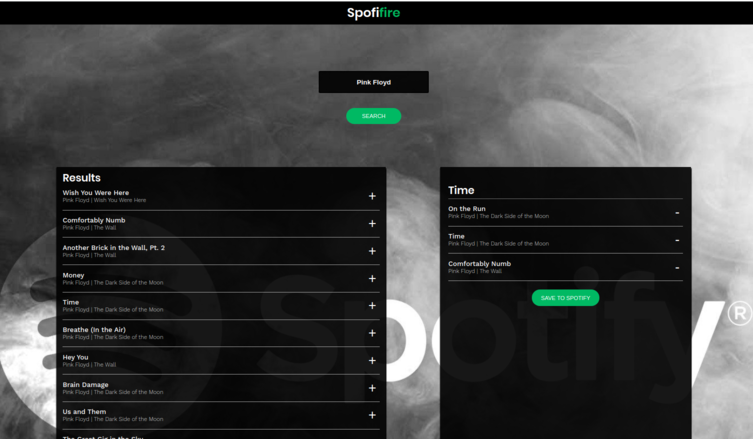

# Spotifire

[Live here](https://spotifire.netlify.app/) for an **unknown period** of time.

Spotifire is a single page ReactJS application. It gives users the ability to login to `www.spotify.com` with their credentials, and create custom playlists. You don't have to worry about me stealing your password, all backend is cranking @ `www.spotify.com`

## Stack used

- ReactJS
- Spotify API

## Installation

The API Key 🗝️ is not provided ! You have to register on www.spotify.com, then navigate to `https://developer.spotify.com/dashboard`, click 'create a client ID', you can name your app as you like. Spotify will give you 32 symbol API Key 🗝️ (Client ID). In the settings, make sure that Redirect URIs is set to http://localhost:3000

edit file:

```cs
\util\Spotify.js
```

make sure that redirectURI is set to: what ever you put in you app settings on spotify web site, replace clientID value with your valid API key 🗝

```cs
const redirectURI = 'http://localhost:3000';
const clientID = 'a23dz................2wfg3';
```

now download dependencies and run

```cs
npm i
npm run
```

now SPOTIFIRE app running in browser, enter song/artist name, click + to add it to playlist, enter playlist name, click 'save' you should see it in your playlists.

## Author

IURII LYTVYN

## License

[MIT](https://choosealicense.com/licenses/mit/)

## Screenshot


